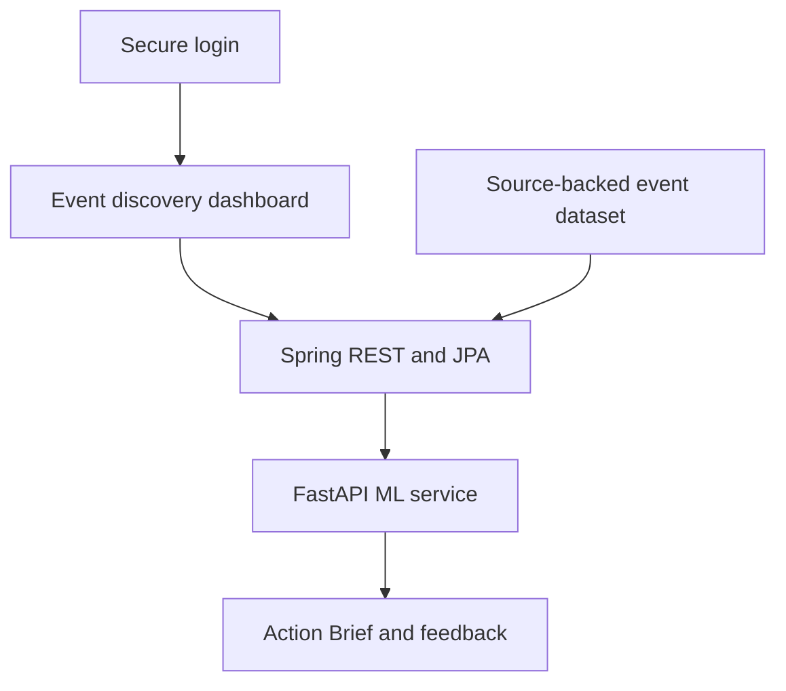

# Event to Impact

**Discover events that matter — an explainable AI discovery platform for useful events and awareness programmes across India in 2026–2027.**

Event to Impact helps a person answer four practical questions:

1. Which health, education, career, safety, technology, environment, civic or inclusion events match my interests?
2. Who does each event help, and what useful action can I take?
3. Is the annual date verified, and are local programme details confirmed or still due for recheck?
4. Why did the recommendation model rank one event above another?

The project does **not** claim live CCTV analytics, exact attendance or invented local events. It applies machine learning where real data exists—matching interests with event purpose and audience—and keeps public-activity context as a separate, explainable heuristic.

## What makes the project different

- 44 source-backed records: 22 annual events for both 2026 and 2027
- 10 public-impact areas: Career, Civic, Education, Environment, Health, Inclusion, Livelihood, National, Safety and Technology
- Audience, impact goal, participation mode and original source on every event
- TF-IDF unigram/bigram model with cosine-similarity ranking
- Logistic-regression preference layer that activates only after at least 10 mixed feedback labels
- Live model card showing model mode, version, vocabulary, catalog coverage and feedback threshold
- Explicit `CONTENT_BASED`, `HYBRID_LEARNED` and `RULE_FALLBACK` modes
- Action Brief with purpose, audience, participation, model evidence, source confidence and another useful match
- Honest 2027 policy: annual dates can be fixed while local programme details remain TBA
- Persistent account registration, Spring Security login, CSRF protection and BCrypt password hashing
- REST API, JPA/H2 persistence, Docker Compose and CI

## Architecture



## Technology

- Java 17, Spring Boot 4, Spring MVC, Spring Security and Spring Data JPA
- H2 by default; optional MySQL profile
- Python 3.10+, FastAPI and scikit-learn
- TF-IDF, cosine similarity and logistic regression
- HTML, CSS and vanilla JavaScript
- JUnit 5, AssertJ, Mockito and pytest
- Maven Wrapper, Docker Compose and GitHub Actions

## Run on Windows

Open the folder that directly contains `pom.xml`, `mvnw.cmd`, `setup-ml.cmd` and `run-demo.cmd`.

One-time setup:

```powershell
.\setup-ml.cmd
```

Test the Java application:

```powershell
.\mvnw.cmd clean test
```

Start the full demo:

```powershell
.\run-demo.cmd
```

Then open [http://localhost:8082](http://localhost:8082).

Create an account from the login page using any valid username and a password of at least six characters. Accounts are stored in the file-backed H2 database and remain available after restart.

Optional interviewer demo login:


`run-demo.cmd` opens the ML service on port `8001` and the Spring application on port `8082`. If the ML service is stopped, the dashboard remains usable and clearly displays `Rule fallback`.

Local account data is stored in `data/event-to-impact-db.mv.db`. This generated database file is excluded from Git. Passwords are never stored as plain text.

## API

| Method | Endpoint | Purpose |
|---|---|---|
| GET | `/api/events?year=2027` | Search and filter event records |
| GET | `/api/events/{id}` | Read event purpose, audience and provenance |
| GET | `/api/events/{id}/risk` | Read public-activity band, confidence and reasons |
| POST | `/api/recommendations` | Rank events for a user profile |
| POST | `/api/feedback` | Save a preference label and forward it for learning |
| GET | `/api/model-card` | Read model mode, vocabulary and limitations |
| GET | `/api/alerts` | Read upcoming and programme-verification alerts |
| GET | `/api/insights` | Read dataset summary metrics |
| GET | `/api/health` | Check Spring service status |

Example request:

```json
{
  "interests": ["career skills youth", "technology cyber security"],
  "maxBudget": 0,
  "crowdTolerance": "MODERATE",
  "companions": "STUDENTS",
  "accessibleOnly": false,
  "environment": "ANY",
  "from": "2027-01-01",
  "to": "2027-12-31"
}
```


## Dataset policy

- The seed and CSV contain 22 useful annual events for 2026 and the same 22 annual observances for 2027.
- Annual dates are linked to government, UN, WHO, UNESCO or other public institutional sources.
- A fixed annual date does not imply that a local venue or programme has been announced.
- 2027 local programme details are explicitly marked for recheck.
- Venue capacity and expected attendance remain zero because no attendance ground truth is available.
- No protest, emergency, private event or unscheduled gathering is predicted.

See [methodology](docs/METHODOLOGY.md), [model card](docs/MODEL_CARD.md), [data dictionary](docs/DATA_DICTIONARY.md) and [limitations](docs/LIMITATIONS.md).

## Optional MySQL run

```powershell
$env:SPRING_PROFILES_ACTIVE="mysql"
$env:DB_URL="jdbc:mysql://localhost:3306/event_to_impact?createDatabaseIfNotExist=true"
$env:DB_USERNAME="root"
$env:DB_PASSWORD="your_password"
.\mvnw.cmd spring-boot:run
```

H2 is the default and requires no database installation.

